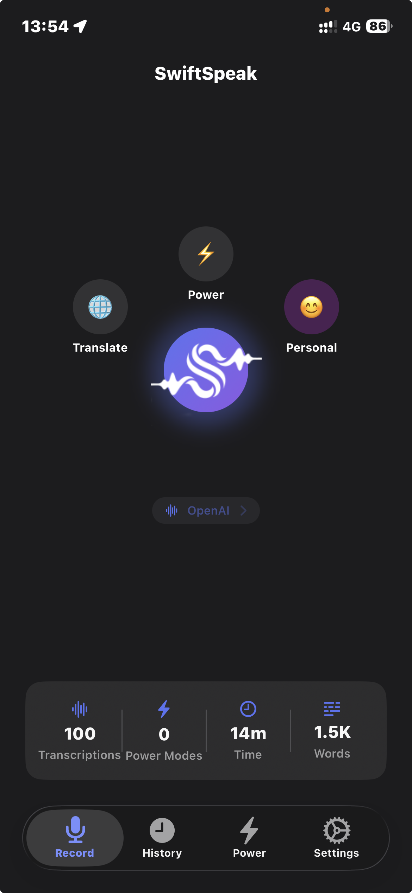
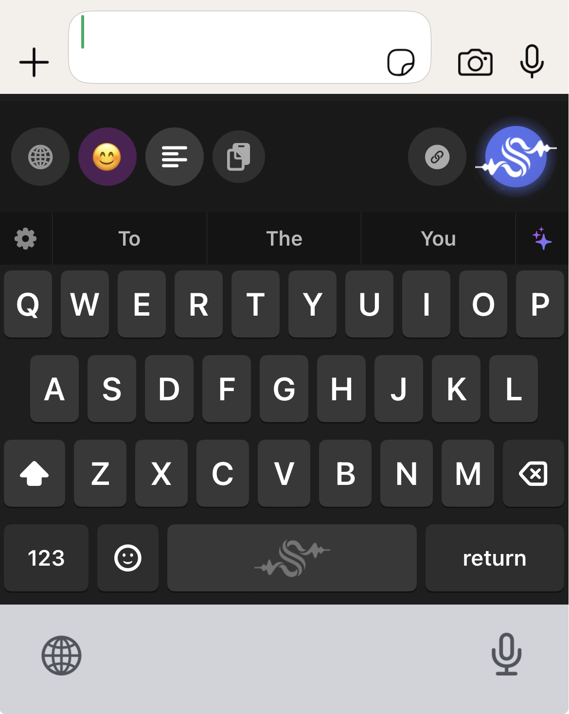
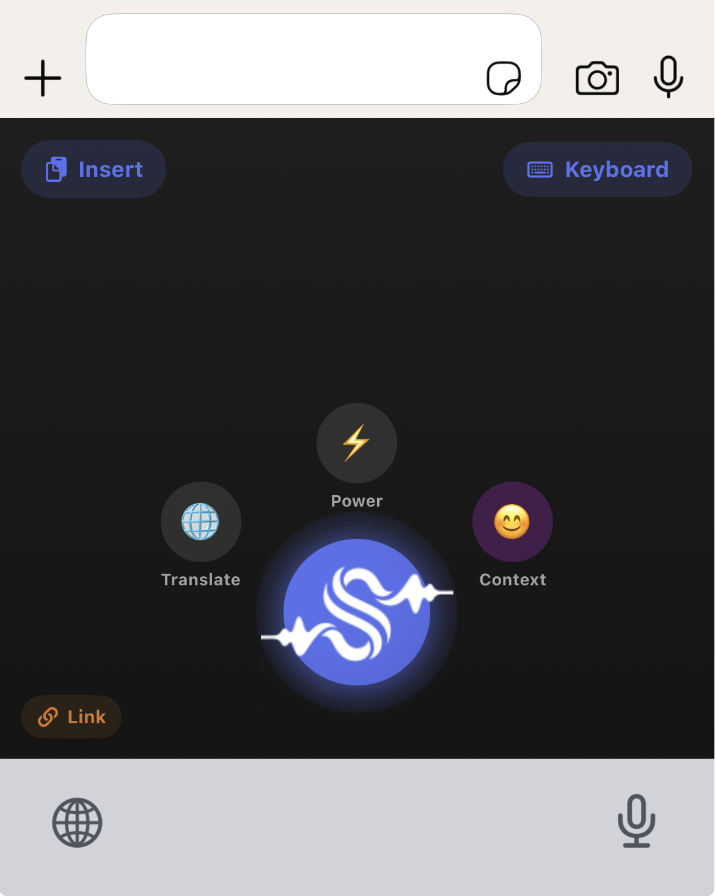
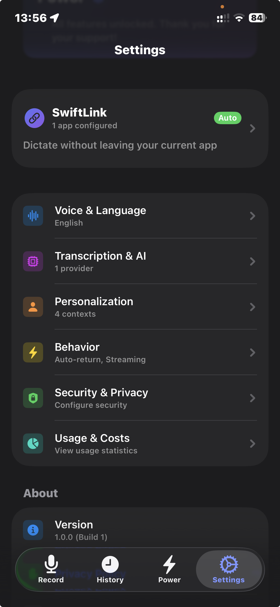
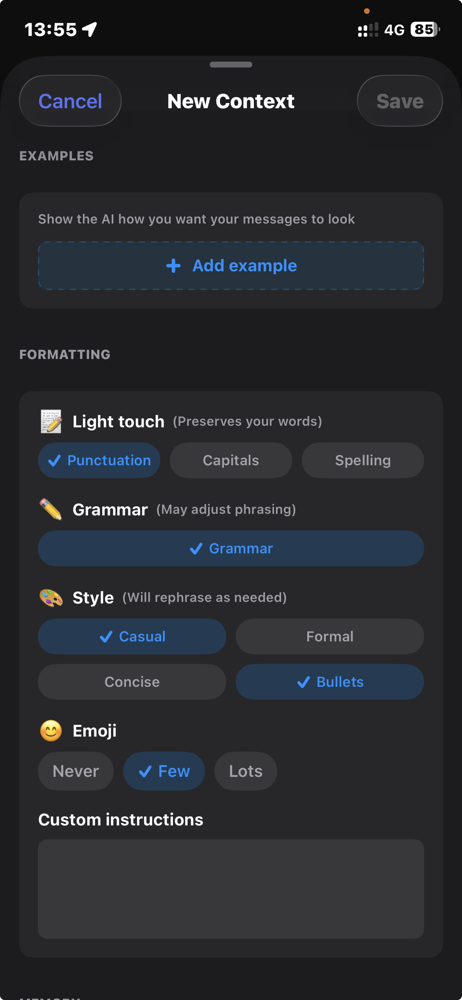
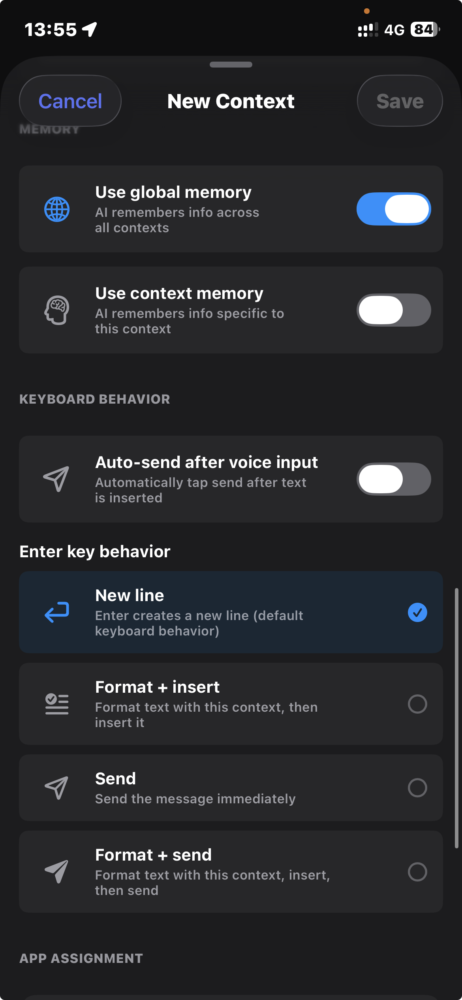
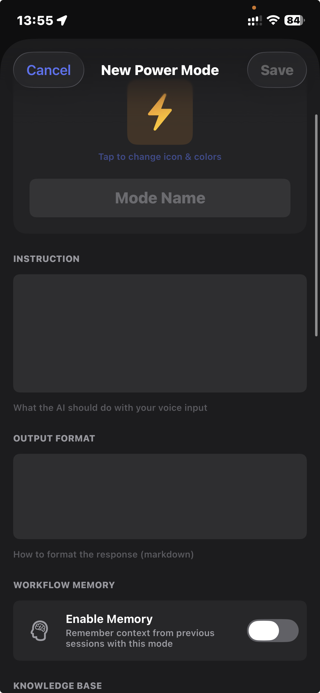
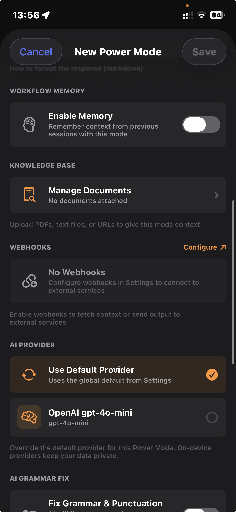
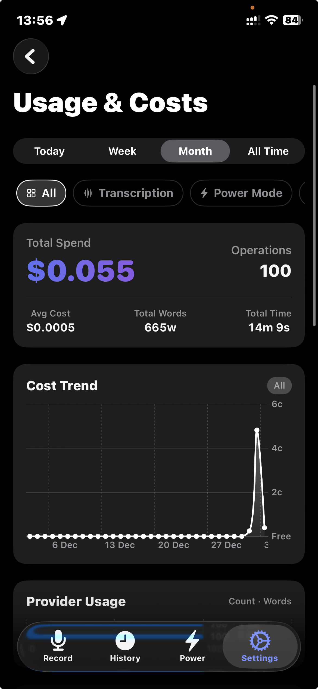
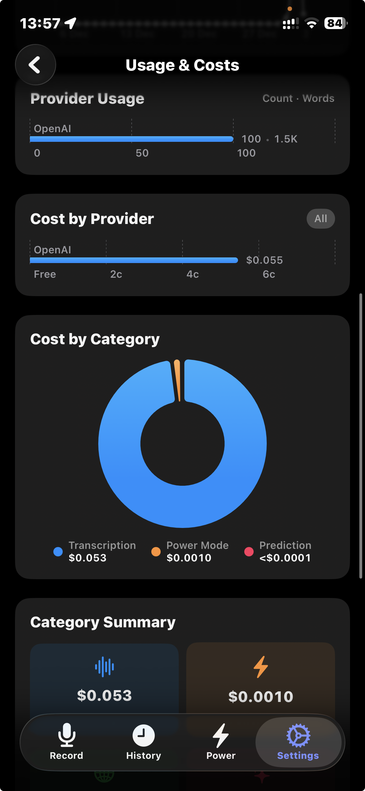

<p align="center">
  
</p>

<h1 align="center">SwiftSpeak</h1>

<p align="center">
  Voice-to-text for iOS and macOS, done well.<br>
  Hotkeys, keyboard extension, AI formatting on the fly.
</p>

<p align="center">
  <b>iOS</b> &bull; <b>iPadOS</b> &bull; <b>macOS</b>
</p>

<p align="center">
  <a href="https://pawelgawliczek.cloud/apps/swiftspeak">Project Page</a> &bull;
  <a href="https://pawelgawliczek.cloud/apps/swiftspeak/privacy">Privacy Policy</a> &bull;
  <a href="https://pawelgawliczek.cloud/contact">Contact</a>
</p>

---

SwiftSpeak transforms raw dictation into formatted, contextually appropriate text. Instead of dumping unformatted speech into your apps, it learns how you write and adapts output to match your style and context.

## Screenshots

<p align="center">
  
  
  
  
</p>

<p align="center">
  
  
  
  
</p>

<p align="center">
  
  
</p>

## How It Works

iOS keyboard extensions cannot access the microphone directly. SwiftSpeak uses a two-app architecture:

1. The **keyboard extension** provides a full QWERTY keyboard with a mic button
2. Tapping the mic opens the **containing app** via URL scheme (`swiftspeak://`)
3. The app records audio, calls your configured transcription API, applies AI formatting
4. Formatted text is passed back through App Groups and auto-returns to the original app

On macOS, a menu bar app with a global hotkey handles everything in one step.

## Features

- **AI formatting** - Dictate and get properly formatted emails, messages, or documents
- **Context switching** - Automatically adapts formatting based on the active app (Gmail = Work, WhatsApp = Personal)
- **Three-tier memory** - Global, per-context, and per-session memory learns your writing style
- **Power Modes** - Voice-activated AI agents with document RAG, webhooks, and version history
- **100+ languages** - Transcription and autocorrect across 13 keyboard languages
- **Privacy Mode** - Force local-only processing with WhisperKit, Apple Intelligence, or Apple Translation
- **Meeting recording** - Record and transcribe meetings with AI-generated summaries and action items
- **Cost analytics** - Built-in dashboard tracking spend by provider and category
- **BYOK (Bring Your Own Key)** - Use your own API keys, no middleman markup

### Supported Providers

| Type | Providers |
|------|-----------|
| Transcription | OpenAI Whisper, Deepgram, AssemblyAI, Google STT, WhisperKit (local), Parakeet MLX (local) |
| Formatting/LLM | OpenAI, Anthropic, Google Gemini, Apple Intelligence (local) |
| Translation | OpenAI, Anthropic, Google, DeepL, Azure Translator, Apple Translation (local) |

### Estimated API Costs

| Usage | Monthly Cost |
|-------|-------------|
| Light (~50 short transcriptions/day) | ~$0.15 |
| Moderate (~150 transcriptions/day) | ~$0.45 |
| Heavy (~400 longer transcriptions/day) | ~$1.20 |
| Local-only (WhisperKit + Apple Intelligence) | $0 |

## Requirements

- Xcode 15+
- iOS 17.0+ / macOS 13.5+
- iOS 18.0+ for Apple Translation (gracefully disabled on older versions)
- Swift 5.9+

## Getting Started

### 1. Clone the repository

```bash
git clone https://github.com/pawelgawliczek/SwiftSpeak.git
cd SwiftSpeak
```

### 2. Set up Firebase (optional, for Remote Config)

Firebase Remote Config is used to deliver updated provider model lists and pricing. It is optional - the app includes a bundled fallback config.

```bash
cp SwiftSpeak/SwiftSpeak/GoogleService-Info.plist.template SwiftSpeak/SwiftSpeak/GoogleService-Info.plist
```

Edit the file with your Firebase project credentials, or leave the template as-is to skip Remote Config.

### 3. Configure signing

Open the project in Xcode:

```bash
open SwiftSpeak/SwiftSpeak.xcodeproj
```

Update signing for all three targets:

| Target | Bundle ID |
|--------|-----------|
| SwiftSpeak (iOS) | `your.bundle.id.SwiftSpeak` |
| SwiftSpeakKeyboard | `your.bundle.id.SwiftSpeak.SwiftSpeakKeyboard` |
| SwiftSpeakMac | `your.bundle.id.SwiftSpeakMac` |

Update the App Group identifier in these files to match your own:

- `SwiftSpeak/SwiftSpeakCore/Sources/SwiftSpeakCore/Utilities/Constants.swift` - `appGroupIdentifier`
- `SwiftSpeak/SwiftSpeakKeyboard/Shared/Constants.swift` - `appGroupIdentifier`

The current App Group is `group.pawelgawliczek.swiftspeak`. Replace it with your own (e.g., `group.com.yourname.swiftspeak`).

### 4. Install local dependencies

The project references two local Swift packages that live alongside the main project:

```
SwiftSpeak/          (this repo)
WhisperKit-Package/  (local on-device transcription)
```

Clone [WhisperKit](https://github.com/argmaxinc/WhisperKit) next to the SwiftSpeak directory:

```bash
cd ..
git clone https://github.com/argmaxinc/WhisperKit.git WhisperKit-Package
```

If you don't need local transcription, remove the WhisperKit package reference from the Xcode project.

### 5. Build and run

Select the **SwiftSpeak** scheme and run on a simulator or device.

For the keyboard extension to work on a real device:
1. Build and run the main app
2. Go to **Settings > General > Keyboard > Keyboards > Add New Keyboard**
3. Select **SwiftSpeak**
4. Enable **Allow Full Access** (required for App Groups communication)

### 6. Configure an AI provider

On first launch, the onboarding flow will guide you through adding an API key. At minimum, you need one transcription provider (e.g., OpenAI with a Whisper-capable key).

For fully local operation with no API keys:
- Use **WhisperKit** for transcription
- Use **Apple Intelligence** for formatting (requires iOS 18.1+ on supported devices)
- Use **Apple Translation** for translation (requires iOS 18.0+)

## Project Structure

```
SwiftSpeak/
├── SwiftSpeakCore/           # Shared Swift Package (models, protocols, constants)
├── SwiftSpeak/               # iOS containing app
│   ├── Services/             # Providers, orchestration, networking, memory, RAG
│   ├── Views/                # SwiftUI views (onboarding, settings, power mode, etc.)
│   └── Shared/               # Constants, Theme, data models
├── SwiftSpeakKeyboard/       # iOS keyboard extension (QWERTY + voice mode)
├── SwiftSpeakMac/            # macOS menu bar app
├── SwiftSpeakTests/          # Unit tests
└── docs/                     # Subsystem documentation
```

See [docs/FILE_STRUCTURE.md](SwiftSpeak/docs/FILE_STRUCTURE.md) for the full file tree.

## Running Tests

```bash
xcodebuild test \
  -project SwiftSpeak/SwiftSpeak.xcodeproj \
  -scheme SwiftSpeak \
  -destination 'platform=iOS Simulator,name=iPhone 16 Pro'
```

## Architecture Docs

| Document | Description |
|----------|-------------|
| [ORCHESTRATION.md](SwiftSpeak/docs/ORCHESTRATION.md) | Transcription and Power Mode execution flows |
| [SWIFTLINK.md](SwiftSpeak/docs/SWIFTLINK.md) | Background dictation via Darwin notifications |
| [MEMORY_SYSTEM.md](SwiftSpeak/docs/MEMORY_SYSTEM.md) | Three-tier AI memory (global, context, power mode) |
| [LOGGING.md](SwiftSpeak/docs/LOGGING.md) | Privacy-safe unified logging system |
| [MACOS_PORT.md](SwiftSpeak/docs/MACOS_PORT.md) | macOS menu bar app architecture |

## Links

- **Project page:** [pawelgawliczek.cloud/apps/swiftspeak](https://pawelgawliczek.cloud/apps/swiftspeak)
- **Privacy Policy:** [pawelgawliczek.cloud/apps/swiftspeak/privacy](https://pawelgawliczek.cloud/apps/swiftspeak/privacy)
- **Terms of Service:** [pawelgawliczek.cloud/apps/swiftspeak/terms](https://pawelgawliczek.cloud/apps/swiftspeak/terms)
- **Contact:** [pawelgawliczek.cloud/contact](https://pawelgawliczek.cloud/contact)

## License

MIT License. See [LICENSE](LICENSE) for details.


